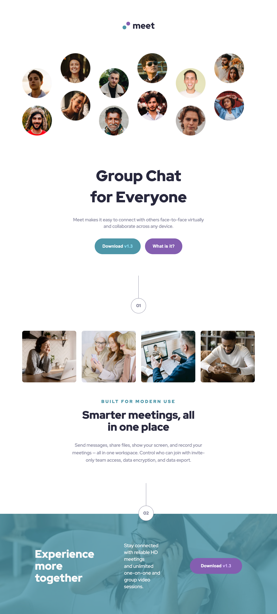

# Frontend Mentor - Meet landing page solution

This is a solution to the [Meet landing page challenge on Frontend Mentor](https://www.frontendmentor.io/challenges/meet-landing-page-rbTDS6OUR). Frontend Mentor challenges help you improve your coding skills by building realistic projects.

## Table of contents

- [Overview](#overview)
  - [The challenge](#the-challenge)
  - [Screenshot](#screenshot)
  - [Links](#links)
- [My process](#my-process)
  - [Built with](#built-with)
  - [What I learned](#what-i-learned)
  - [Continued development](#continued-development)
  - [Useful resources](#useful-resources)
- [Author](#author)

**Note: Delete this note and update the table of contents based on what sections you keep.**

## Overview

### The challenge

Users should be able to:

- View the optimal layout depending on their device's screen size
- See hover states for interactive elements

### Screenshot

### Links

- Solution URL: [Add solution URL here](https://your-solution-url.com)
- Live Site URL: [Add live site URL here](https://your-live-site-url.com)

## My process

### Built with

- Semantic HTML5 markup
- CSS custom properties
- Flexbox
- CSS Grid

### What I learned

I learn how to combine min-width and max-width media queries in order to target a range of specific viewport sizes. I also further increased my knowledge of CSS background images.

### Continued development

I would like to further increase my knowledge of using CSS grid to layout my elements on the page.

### Useful resources

- [Kevin Powell - Introduction Controlling background-images | CSS Tutorial](https://www.youtube.com/watch?v=3T_Jy1CqH9k) - This helped me use mutliple background iamges for my body in CSS and will use it going forward.

## Author

- Frontend Mentor - [@JGedd](https://www.frontendmentor.io/profile/JGedd)
